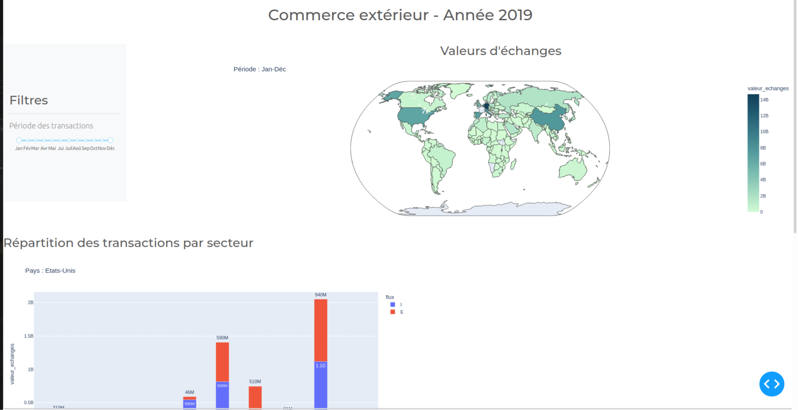

# Projet-Big-Data
Analyse du commerce extérieur de la France pour l’année 2019

## Authors :
- Youcef CHORFI
- Gontran GILLES

## Dependencies
* Python 2/3 with [NumPy](http://www.numpy.org/)/[SciPy](https://www.scipy.org/)
* [SQLAlchemy](https://www.sqlalchemy.org/)
* Dash
* Plotely 


## Installation

Simply clone the repository:

```bash
git clone https://github.com/Youcef-11/Projet-Big-Data.git
cd Projet-Big-Data
```
## Dashboard
<p align="center"><a href=https://github.com/Youcef-11/Projet-Big-Data/blob/master/results/dashboard.png?raw=true></a></p>

## MCD 'Modèle Conceptuel des Données'
<p align="center"><a href=https://github.com/Youcef-11/Projet-Big-Data/blob/master/results/MCD.jpg?raw=true></a></p>

## MLD 'Modèle Logique des Données'
<p align="center"><a href=https://github.com/Youcef-11/Projet-Big-Data/blob/master/results/MLD.jpg?raw=true></a></p>

## Data viz example
<p align="center"><a href=https://github.com/Youcef-11/Projet-Big-Data/blob/master/results/Viz.jpg?raw=true></a></p>

## Description du contenu du dossier

- Il faut récupérer les datas depuis 
```
https://www.data.gouv.fr/fr/datasets/statistiques-nationales-du-commerce-exterieur/
```
- Il faut organiser les fichiers comme suit :
- 2 dossiers 'National-2019-export', 'National-2019-import'
	récupérés sur data.gouv
	contient 5 fichiers textes qui sont les données brutes
- Dossier 'Nomenclature' : contient table de passage des codes
	NC8 2019 vers 2020
- Dossier Table_pays : contient le PDF qui nous a permis de créer
	les zones économiques
- Deux fichiers Python :
 	* create_tables.ipynb : prétraitement des données et peuplement des tables
	* dash_gui.py : interface graphique
- 'modélisation_commerce_ex.mcd' : MCD et MLD
- pays_continents.xlsx : récupéré sur internet, a servi à compléter
	la table pays
- 'rapport_projet_big_data_CHORFI_GILLES.pdf'
- 'texte_zone_eco.txt' : nous a servi à créer la table zone-éconimique

